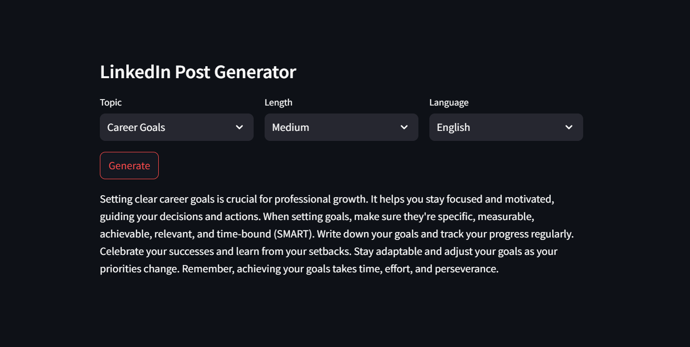

# Linkedin_Posts_Generator_with_GenAI
Project that does a research on a topic and generates a Linkedin Post for it.

In this project, I developed a LinkedIn post generator tool leveraging advanced Generative AI technologies. The project utilized the Llama 3.2 open-source Large Language Model (LLM), integrated with LangChain for managing complex workflows and enabling dynamic interactions. I used Streamlit to create an intuitive and user-friendly web interface, allowing users to easily generate engaging LinkedIn posts.
This project showcases my ability to build end-to-end AI solutions, combining expertise in LLMs, workflow automation, and web app development, all aimed at creating impactful AI-driven applications.

